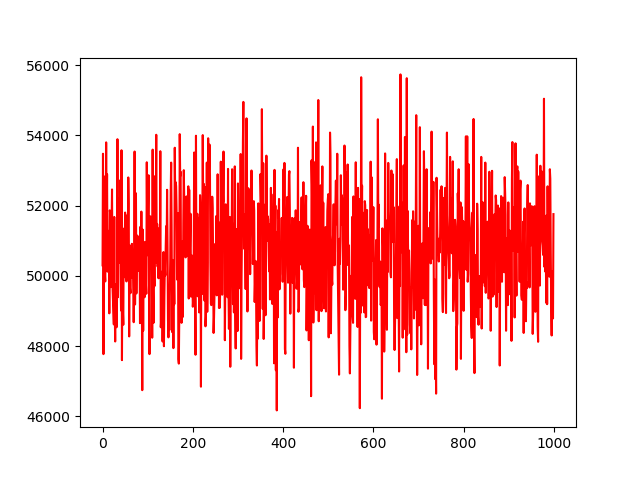
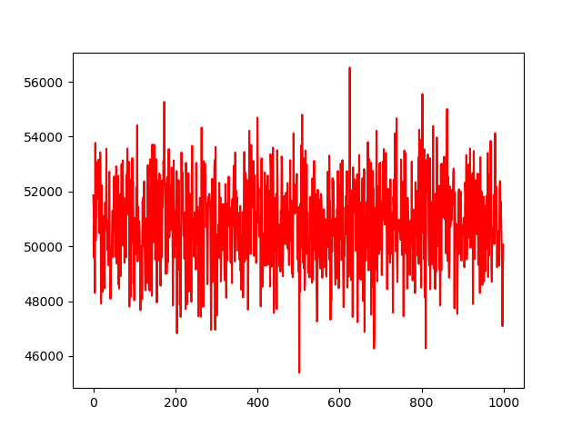
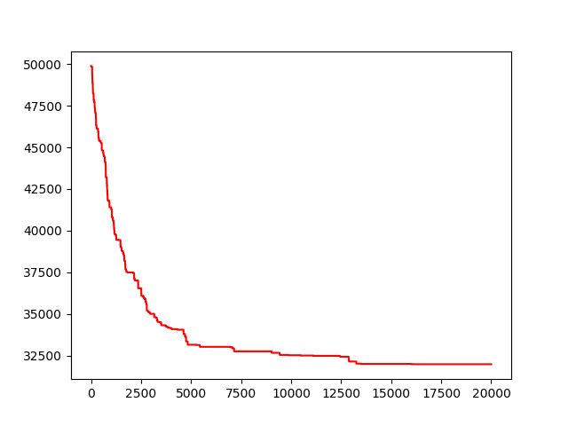
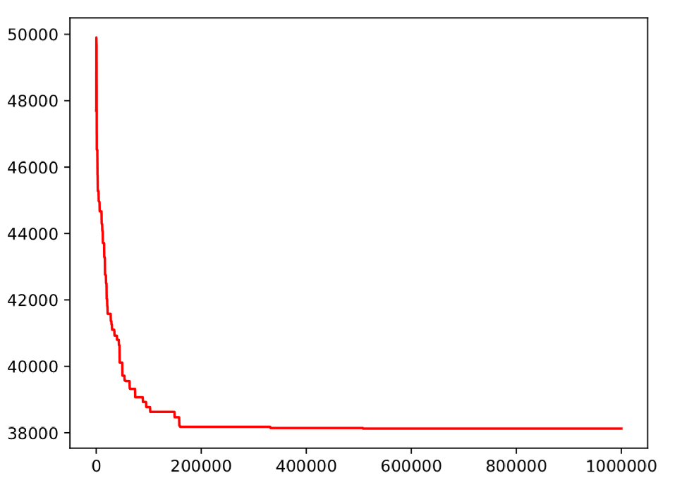
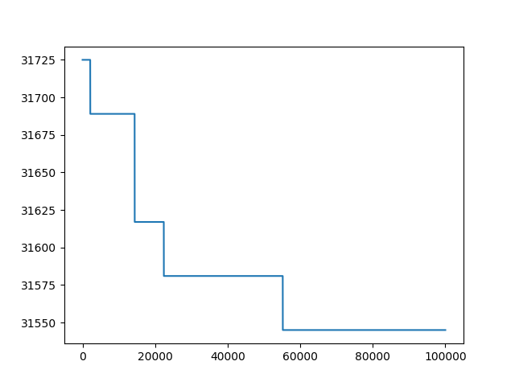

Welcome to the readme for the results.
In here, we will story pictures of the best results so far, so we can always find them.
A lot of plots have been made, so we can see how the algorithms did when they were run several times.

Here are some overviews of the algorithms to show some results. All used map 1.
### First fit batteries
Ran 1000 times, pay attention to the costs which are above 46000.

### First fit houses
Ran 1000 times, costs rarely drop below 46000.

### Hill climber
hill climber tried 20.000 different swaps.

### Differential evolution
After a million generations the total costs for map 1 were 63124.0, which is included with 25000 for the batteries.

Mixed with the Hillclimber, and with 100.000 generations, we get these results:
Total costs are 31545 without batteries.

All total costs here are still without moving the batteries.